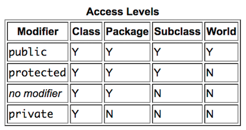
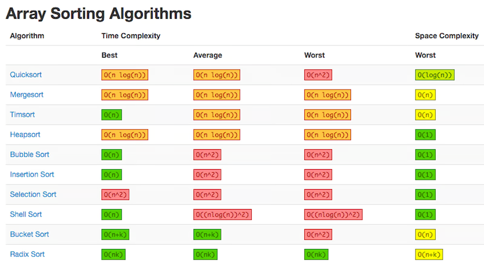
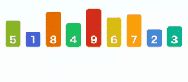
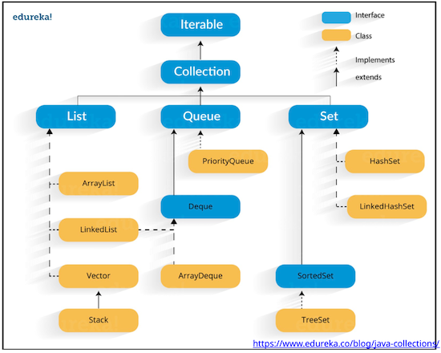

# 1. Top

OBJECT-ORIENTED PROGRAMMING:

1. ABSTRACTION. Exposing only the required characteristics & behaviors: routine computations, data fields & methods are hidden in 'black boxes'.
2. INHERITANCE. A way to create new classes that reuse the properties and behaviors of existing classes.
3. POLYMORPHISM. The ability of a reference variable to take multiple forms.
4. ENCAPSULATION. Protective barrier that prevents data & code from being randomly controlled outside your class.

# 2. Class

Definition of an object type.

OBJECT. INSTANCE. Instantiation of a class created using the `new` operator.

FIELD. INSTANCE VARIABLE. MEMBER VARIABLE. Variables inside a class.

Use the `.` operator to set or get values of the object's instance variables:
`name.variable`

OVERLOADING. Multiple methods can have the same signature, return type and method name but different parameter lists (different number of parameters).

# 3. Inheritance

A way to create new classes that reuse the properties and behaviors of existing classes.

SUBCLASS. Class that inherits all submethods and instance variables from its ancestor class and can add its own.
Inheritance can only add or override features.

LISKOV SUBSTITUTION. Type of value stored in a variable must be **_at least_** the type of that variable.

- If type A 'is a' type B, an instance of type A can be assigned to a variable of type B.
- When calling a method on an object, the version of the method is determined by the type of the **value**.
- Can only call methods on an object that are guaranteed by the type of the **object**. The way to override this is typecasting, but must be careful.
  - `Type y = (Type) x`

`extends`. Indicates a class extends from a superclass.

- `class Child extends ParentClass`

All classes without an explicit `extends` keyword implicitly extend `Object`.

# 4. Overriding

OVERRIDING. Modifying the implementation of a class defined in the superclass.

- Signature, return type, name and parameters must **exactly match**.
- `@Override`. Annotation used when overriding, checking the above condition via the compiler.

Common methods to override include `String toString()` and `boolean equals(Object o)`.

# 5. Abstract Classes

Any class containing one or more abstract methods.

- Must be declared with the keyword `abstract`: `abstract class MyClass`.

ABSTRACT METHOD. Method that has been declared without being defined.

- `abstract double getArea()`

You cannot instantiate an abstract class.

When extending abstract classes:

1. If a subclass defines all abstract methods, it is 'complete' and thus can be instantiated.
2. If a subclass does not define all abstract methods, it is 'incomplete' and thus cannot be instantiated.

You can declare a class to be abstract even if it doesn't contain any abstract methods to prevent it from being instantiated.

Rules:

1. An abstract class must be declared with the keyword `abstract`.
2. It can have abstract & non-abstract methods.
3. It cannot be instantiated.
4. It can have final methods.
5. It can have constructors and static methods.

Used when (1) You are unsure of how a method should be implemented. (2) You don't want the possibility of objects of that class.

Neither a class nor a method can be both abstract and final.

# 6. Interfaces

Reference type similar to classes - collection of abstract methods or group of related methods with empty bodies.

- `interface Shape`

Implies 100% abstraction: no implemented methods.

Can contain variables but must be static & final.

`implements`. A promise to define all the methods that were declared in the interface.

- `class Circle implements Shape`.
- `instanceof` also applies if a class implements an interface.

Abstract Classes v. Interfaces:

1. Abstract classes can have constructors, instance variables & concrete methods.
2. Abstract classes may be extended by a subclass, which may implement the abstract methods but doesn't have to. Interfaces are implemented by another class, which must implement its abstract methods.

MULTIPLE INHERITANCE. The ability of extending from more than one type. Allowed for interfaces, but not classes because interfaces do not define fields or method bodies but classes do, which could create conflicts.

# 7. Constructors

CONSTRUCTOR. Method that always shares the same name as its class - responsible for establishing the state of the new object with appropriate initial values for its instance variables.

A constructor is **NOT** required. If a constructor is not provided, Java provides a zero parameter constructor that sets instance variables to their default values (0 for primitive types and `null` for object types).

# 8. Access Control

Protective barrier that prevents data & code from being randomly controlled outside your class.



Package is the 'default', if unspecified.

# 9. Static

`static`:

- STATIC FIELD. Common property of all objects. Saves memory, created when the class is loaded.
- STATIC METHOD. Method that belongs to a class, rather than an object of that class. Thus, they can be invoked without instantiating the class.
  - Difference from instance methods: (1) Cannot be called on an instance. (2) `this` keyword is unavailable.

`final`:

- FINAL VARIABLE. Initialized as part of a declaration but never gets a new value.
- FINAL METHOD. Cannot be overriden by a subclass.
- FINAL CLASS. Cannot be subclassed.

# 10. This, Super

`this`. Refers to the current object, differentiating between an instance variable and a local variable with the same name.

`super`. Accesses the superclass.

- `super(x, y)`. Calls the superclass constructor.
- `super.foo()`. Calls the superclass method `foo`.
- `super.name`. Accesses the superclass field `name`.

# 11. Postfix Notation

Mathematical notation that voids the need for parentheses.

- Reads equations from left to right, distinguishing between two types of characters: operators and operands.

Infix: (A + B) _ C - (D - E) _ (F + G)

Postfix: A B + C _ D E - FG + _ -

# 12. Big O

If, for sufficiently large values of n, the values of f are positive and less than those of a positive multiple of g, then f is of order at most g, written “f (n) is O(g(n)).”

# 13. Stacks

Stores an 'array' of elements only with two functions:

- `push`. Add an element at the 'top' of the stack.
- `pop`. Remove & return the element at the 'top' of the stack.

LIFO. Last in, first out.

# 14. Queues

Stores an 'array' of elements with two basic functions:

- `enqueue`. Inserts an element at the 'end' of the queue.
- `deque`. Removes the element at the 'front' of the queue.

FIFO. First in, first out.

# 15. Linked Lists

Recursive data structure that is either empty or a reference to a node having a data item & reference to a linked list.

A sequence of nodes chained together.

- NODE. Data item & reference to the next node.

# 16. Doubly Linked Lists

Contains nodes with bidirectional references, one to the next node & one to the previous node.

- Improves flexibility at the cost of complexity and memory overhead.

# 17. Array Lists

`ArrayList<Integer> numbers = new ArrayList<Integer>()`

Methods:

1. `size()`. Number of elements in the list.
2. `get(int index)`. Returns element at a specified position.
3. `add(E e)`. Appends specified element to the end of the list.
4. `add(int index, E e)`. Inserts an element at the specified position and shifts any subsequent elements to the right.
5. `remove(int index)`. Removes the element at the specified position in the list and shifts any subsequent elements to the left.

Advantages of array lists:

1. Arrays have fixed length.
2. Arrays can't insert or delete an item.
3. Arrays can't search for an item with a particular value.

Advantages of arrays:

1. Array takes less memory than ArrayList for storing the same number of elements.
2. Array can accommodate both primitive & object types, but ArrayList can only accommodate objects.
3. Array can be multidimensional, but ArrayList is always one-dimensional.

# 18. Sorting Algorithms

BUBBLE SORT. Compare elements of the 'unsorted' array from left to right, swapping the second element with the first if it is smaller.

SELECTION SORT. Compare every element in the 'unsorted' array, swapping the first element with the minimum element in the array.

INSERTION SORT. Insert each element in the 'unsorted' array into the 'sorted' array.

MERGE SORT. Divide an array into two halves, sort each half then merge the sorted halves into a sorted array. Recurse.

QUICK SORT. Pick a pivot, partition in the array into two arrays on the 'left' and 'right' of the pivot. Recurse.

## TIME COMPLEXITY, BEST & WORST CASE



BUBBLE SORT.

- BEST: Scan through the list once.
- AVERAGE: Scan through the list m < n times, resulting in a partial triangular sum.
- WORST: Scan through the list n times, resulting in a full triangular sum.

SELECTION SORT.

- BEST: Scan through the list n times, making no swaps, resulting in a full triangular sum.
- AVERAGE: Scan through the list n times, making some swaps, resulting in a full triangular sum.
- WORST: Scan through the list n times, making swaps every time, resulting in a full triangular sum.

INSERTION SORT.

- BEST: Scan through the list once.
- AVERAGE: Scan through the list m < n times, resulting in a partial triangular sum.
- WORST: Scan through the list n times, resulting in a full triangular sum.

MERGE SORT.

- BEST: Divide the array log n times and scan n / recursion elements, making no swaps.
- AVERAGE: Divide the array log n times and scan n / recursion elements, making some swaps.
- WORST: Divide the array log n times and scan n / recursion elements, swapping every element.

QUICK SORT.

- BEST: Divide the array log n times and scan and swap n / recursion elements.
- AVERAGE: Divide the array log n + O(1) times and scan and swap n + O(1) / recursion elements.
- WORST: Divide the array n-1 times and scan and swap n - 1 elements.

## IMPLEMENTATION

BUBBLE SORT.

```java
static <T extends Comparable<T>> void bubbleSort(T[] arr) {
    for(int i = 0; i < arr.length - 1; i++) {
        boolean swapped = false;
        for(int j = arr.length - 1; j >= i + 1; j--) {
            if(lessThan(arr[j], arr[j - 1])) {
                exchange(arr, j - 1, j);
                swapped = true;
            }
        }
        if(!swapped)
            break;
    }
}
```

SELECTION SORT.

```java
static <T extends Comparable<T>> void selectionSort(T[] arr) {
    for (int i = 0; i < arr.length - 1; i++) {
        int index = i;
        for (int j = i + 1; j < arr.length; j++) {
            if (lessThan(arr[j], arr[index]))
                index = j;
        }
        exchange(arr, i, index);
    }
}
```

INSERTION SORT.

```java
static <T extends Comparable<T>> void insertionSort(T[] arr) {
    for (int i = 1; i < arr.length; i++) {
        for (int j = i; j > 0; j--) {
            if (lessThan(arr[j], arr[j - 1]))
                exchange(arr, j, j - 1);
        }
    }
}
```

MERGE SORT.

```java
static <T extends Comparable<T>> void mergeSort(T[] a, T[] b, int lo, int hi) {
    if(hi <= lo)
        return;
    int mid = lo + (hi - lo) / 2;
    mergeSort(a, b, lo, mid);
    mergeSort(a, b, mid+1, hi);
    merge(a, b, lo, mid, hi);
}
```

```java
static <T extends Comparable<T>> void merge(T[] a, T[] b, int lo, int mid, int hi) {
    for(int k = lo; k <= hi; k++)
        b[k] = a[k];
    int i = lo, j = mid+1;
    for(int k = lo; k <= hi; k++) {
        if(i > mid)
            a[k] = b[j++];
        else if(j > hi)
            a[k] = b[i++];
        else if(lessThan(b[j], b[i]))
            a[k] = b[j++];
        else
            a[k] = b[i++];
    }
}
```

QUICK SORT.

```java
static <T extends Comparable<T>> void quickSort(T[] arr) {
    sort(arr, 0, arr.length-1);
}

static <T extends Comparable<T>> void sort(T[] arr, int lo, int hi) {
    if(hi <= lo)
        return;
    int j = partition(arr, lo, hi);
    sort(arr, lo, j-1);
    sort(arr, j+1, hi);
}

static <T extends Comparable<T>> int partition(T[] arr, int lo, int hi) {
    int i = lo; int j = hi + 1;
    while(true) {
        while(lessThan(arr[++i], arr[lo]))
            if(i == hi)
                break;
        while(lessThan(arr[lo], arr[--j]))
            if(j == lo)
                break;
        if(i >= j)
            break;
        exchange(arr, i, j);
    }
    exchange(arr, lo, j);
    return j;
}
```

## MANUAL EXECUTION

BUBBLE SORT.


SELECTION SORT.



INSERTION SORT.


MERGE SORT.


QUICK SORT.


# 19. Hashtables

HASH TABLE. Saves items in a key-indexed table.

- INDEX is a function of the KEY.

Consists of two things:

1. Hash function h. (converts key into index).
2. Array (table) of size m.

HASH FUNCTION. Converts any given key into a number between [0, M-1].

- It should be consistent: the same key should always return the same number.
- Consists of HASH CODE and COMPRESSION FUNCTION.

### SEPARATE-CHAINING

Hash table consists of an array of linked lists.

- `hash()`. Map key to integer i, between 0 and M-1.
- `insert()`. Put at front of ith chain.
- `search()`. Need to search only ith chain.
- `delete()`. Need to search only ith chain.
- `resize()`.

Number of keys in a list obeys a binomial distribution: average length is N / M and worst case length is N.

Number of probes for `search` and `insert` is proportional to N / M.

Typical choice is M ~ N / 4: double the array when M ~ N / 8 and halve the array when M ~ N / 2.

### LINEAR PROBING

Hash table consists of an array of objects.

- `hash()`. Map key to integer i, between 0 and M-1.
- `insert()`. Put at table index if free, if not try i+1, i+2...
- `search()`. Search table index i if occuppied, if not try i+1, i+2...
- `delete()`. Nope.
- `resize()`.

CLUSTERING. A contiguous block of items.

Typical choice is M ~ 2N: double the array when M < 2N and halve the array when M ~ 8N.

# 20. Supplement

## GENERIC CLASS.

Parameterized class that accepts one or more ‘type’ parameters.

`class BoxedItem<T>`

`BoxedItem<String> box = new BoxedItem<String>`

GENERIC METHOD. Can handle arguments & return values of different types with a single generic method declaration.

- `public <T> void foo (T[] input array)`

Parameter type can be restricted using extends: `public class BoxedItem<T extends Number>`

- Allows you to call any methods that are guaranteed by the stated bound.

Can support more than one generic type: `Pair<A, B>`

## COLLECTION

Java interface to represent a group of objects.

- `size()`, `isEmpty()`
- `contains()`
- `add()`, `remove()`



## DEQUE

DOUBLE-ENDED QUEUE. Java interface that extends `queue`, providing insertion & removal at both ends.
