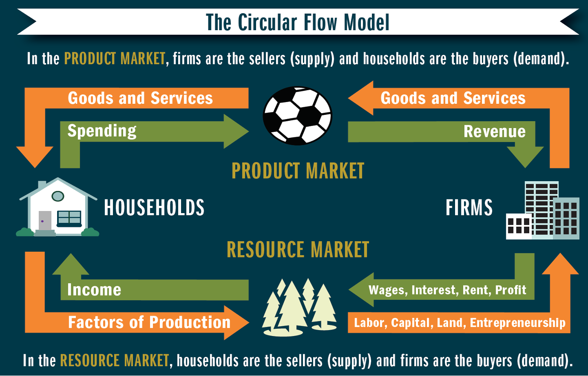
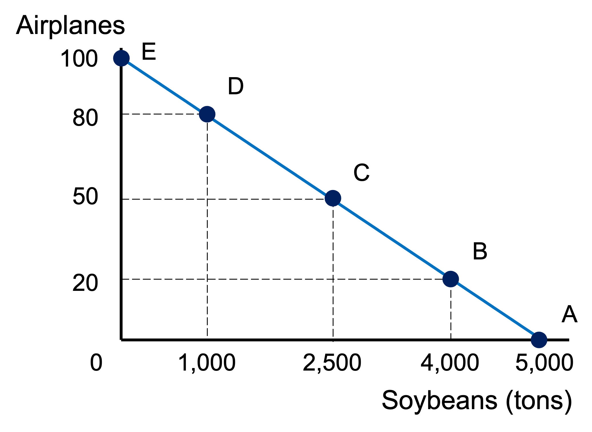
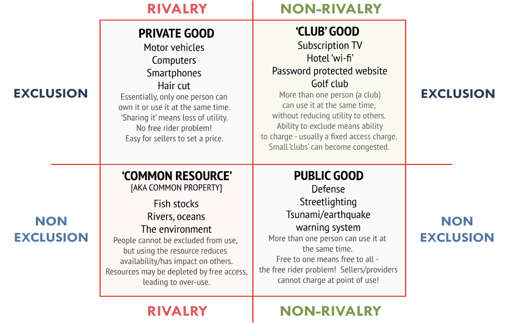

# 1. Ten Principles of Economics

Resources are scarce.

- SCARCITY. The limited nature of society's resources.
- ECONOMICS. The study of how society manages its scarce resources.

## HOW PEOPLE MAKE DECISIONS

1\. People face trade-offs.

2\. The cost of something is what you give up to get it.

- OPPORTUNITY COST. Whatever must be given up to obtain some item.

3\. Rational people think at the margin.

4\. People respond to incentives.

## HOW PEOPLE INTERACT

5\. Trade can make everyone better off.

6\. Markets are usually a good way to organize economic activity.

- MARKET. Group of buyers and sellers. Allocates resources through the decentralized decisions of many firms and households as they interact in markets.
- Adam Smith's INVISIBLE HAND. Prices guide self-interested households and firms to make decisions that maximize society's economic well-being.

7\. Governments can sometimes improve market outcomes.

- Enforcing property rights.
- Promoting efficiency.
- Promoting equality.

## HOW THE ECONOMY AS A WHOLE WORKS

8\. A country's standard of living depends on its ability to produce goods and services.

9\. Prices rise when the government prints too much money.

- INFLATION. An increase in the overall level of prices in the economy.
  - Almost always caused by excessive growth in the quantity of money, causing the value of money to fall.

10\. Society faces a short-run tradeoff between inflation and unemployment.

# 2. Thinking Like an Economist

## SCIENTIST

Economists make assumptions.

- Simplify the complex world and make it easier to understand.

Economists use models to study economic issues.

- Simplified representation of a more complicated reality.

CIRCULAR FLOW DIAGRAM. Visual model of the economy showing how dollars flow through markets among households and firms.

- Two decisionmakers: firms and households.
- Interacting in two markets:
  - PRODUCT MARKET. Market for goods and services.
  - RESOURCE MARKET. Market for factors of production.

### PRODUCTION POSSIBILITIES FRONTIER.

Graph that shows various combinations of outputs that the economy can possibly produce, given the available factors of production and the available production technology.

Points on the PPF are efficient.

Points under the PPF are possible, but inefficient.

Points above the PPF are not possible.

Slope of the PPF reflects the opportunist cost of one good in terms of the other.

Shape of the PPF:

- Straight line = constant opportunity cost.
- Bowed outwards = increasing opportunity cost.
  - As more units of a good are produced, we need to give up increasing amounts of the other good produced

## POLICY ADVISER

Give prescriptive advice about how to improve the economy.

When economists disagree, it's primarily because they have different values and therefore different normative views about what policy should try to accomplish.

# 3. The Market Forces of Supply and Demand

MARKET. A group of buyers and sellers of a particular good or service.

Buyers determine the demand for the product.

Sellers determine the supply of the product.

COMPETITIVE MARKET. Many buyers and many sellers, each has a negligible impact on market price.

PERFECTLY COMPETITIVE MARKET. All goods are exactly the same.

- Buyers are sellers are 'price takers'. No individual can affect the market price.
- At the market price, buyers can buy all they want and sellers can sell all they want.

## DEMAND

QUANTITY DEMANDED. Amount of a good that buyers are willing and able to purchase.

LAW OF DEMAND. Other things equal, when the price of a good rises, the quantity demanded of the good falls.

DEMAND SCHEDULE. A table that shows the relationship between the price of a good and the quantity demanded.

DEMAND CURVE. A graph of the relationship between the price of a good and the quantity demanded.

MARKET DEMAND. Sum of all individual demands for a good or service.

- MARKET DEMAND CURVE. Sum of the individual demand curves horizontally.

Non-price determinants of demand shift the demand curve:

- Number of buyers
- Income
  - NORMAL GOOD. Other things constant, an increase in income leads to an increase in demand.
  - INFERIOR GOOD. Other things constant, an increase in income leads to decrease in demand.
- Prices of related goods
  - Two goods are SUBSTITUTES if an increase in the price of one leads to an increase in the demand for the other.
  - Two goods are COMPLEMENTS if an increase in the price of one leads to a decrease in demand for the other.
- Tastes
- Expectations

## SUPPLY

QUANTITY SUPPLIED. Amount of a good that sellers are willing and able to sell.

LAW OF SUPPLY. Other things equal, when the price of a good rises, the quantity supplied of the good rises.

SUPPLY SCHEDULE. A table that shows the relationship between the price of a good and the quantity supplied.

SUPPLY CURVE. A graph of the relationship between the price of a good and the quantity supplied.

MARKET SUPPLY. Sum of the supplies of all sellers of a good or service.

- MARKET SUPPLY CURVE. Sum of individual supply curves horizontally.

Non-price determinants of supply shift the supply curve:

- Input prices
- Technology
- Number of sellers
- Expectations about the future

## TOGETHER

EQUILIBRIUM. Price has reached the level where the quantity supplied equals quantity demanded.

EQUILIBRIUM PRICE. Price where $Q^S = Q^D$.

SURPLUS. Quantity supplied is greater than quantity demanded.

- Sellers try to increase sales by cutting the price - this causes $Q^D$ to rise and $Q^S$ to fall, which reduces the surplus until the market reaches equilibrium.

SHORTAGE. Quantity demanded is greater than quantity supplied.

- Sellers raise the price - this causes $Q^D$ to fall and $Q^S$ to rise, which reduces the shortage until the market reaches equilibrium.

Analyzing changes in equilibrium:

1. Decide whether an event shifts the supply curve and/or the demand curve.
2. Decide whether the curve(s) shift to the right or to the left.
3. Compare the initial and new equilibrium price and quantity.

# 4. Elasticity

ELASTICITY. Measure of the responsiveness of $Q^d$ or $Q^s$ to a change in one of its determinants.

## DEMAND

PRICE ELASTICITY OF DEMAND. How much the quantity demanded of a good responds to a change in the price of that good.

$$
PED = \frac{\Delta \%Q^d}{\Delta \% P}
$$

- Measures the price sensitivity of buyers.

Price elasticities are always reported as positive numbers.

Midpoint method for calculating percent changes:

$$
PED = \frac{\frac{Q_2-Q_1}{\frac{Q_1+Q_2}{2}}}{\frac{P_2-P_1}{\frac{P_1+P_2}{2}}}
$$

Determinants of price elasticity of demand:

- Price elasticity is higher when close substitutes are available.
- Price elasticity is higher for narrowly defined goods than for broadly defined ones.
- Price elasticity is higher for luxuries than for necessities.
- Price elasticity is higher in the long run.

Demand is ELASTIC when PED > 1.

Demand is INELASTIC when PED < 1.

Demand has UNIT ELASTICITY when PED = 1.

Demand is perfectly inelastic when PED = 0.

- Demand curve is vertical.
- Demand would be the same no matter the price.

Demand curve is perfectly elastic when PED = $\infty$.

- Demand curve is horizontal.
- Any change in price causes demand to drop to zero.

The flatter the demand curve, the greater the price elasticity of demand.

If demand is elastic, a price increase causes total revenue to decrease because the fall in revenue from lower quantity is greater than the increase in revenue from higher prices.

If demand is inelastic, a price increase causes total revenue to increase because the fall in revenue from lower quantity is less than the increase in revenue from higher prices.

INCOME ELASTICITY OF DEMAND. How much the quantity demanded of a good responds to a change in consumers' income.

- Normal goods have a positive income elasticity.
- Inferior goods have a negative income elasticity.
- Sticky goods have zero income elasticity.

CROSS-PRICE ELASTICITY OF DEMAND. How much the quantity demanded of one good responds to a change in the price of another good.

- Substitutes have a positive cross-price elasticity.
- Complements have a negative cross-price elasticity.

## SUPPLY

PRICE ELASTICITY OF SUPPLY. How much the quantity supplied of a good responds to a change in the price of that good.

$$
PES = \frac{\Delta \% Q^s}{\Delta \% P}
$$

Supply is unit elastic when PES = 1.

Supply is elastic when PES > 1.

Supply is inelastic when PES < 1.

Supply is perfectly inelastic when PES = 0.

- Supply curve is vertical.

Supply is perfectly elastic when PES = $\infty$

The flatter the supply curve, the greater the price elasticity of supply.

Determinants of supply elasticity: The more easily sellers can change the quantity they produce.

- Price elasticity of supply is greater in the long run than in the short run.

Supply typically becomes less elastic as quantity rises, due to capacity limits.

# 5. Supply, Demand and Government Policies

## PRICE CONTROLS

PRICE CEILING. Legal maximum on the price at which a good can be sold.

PRICE FLOOR. Legal minimum on the price at which a good can be sold.

A price control is BINDING if it has an effect on the market outcome.

A price control is not binding if it has no effect on the market outcome.

Governments typically use price controls because of unfair market outcomes, but it can lead to market inefficiencies.

## TAXES

TAX INCIDENCE. Manner in which the burden of a tax is shared among participants in a market.

- Determined by the elasticity of demand and elasticity of supply.

# 6. Consumers, Producers and the Efficiency of Markets

WELFARE ECONOMICS. Studies how the allocation of resources affects economic well-being.

## CONSUMERS

WILLINGNESS TO PAY. Maximum amount the buyer will pay for that good.

CONSUMER SURPLUS. Amount a buyer is willing to pay minus the amount the buyer actually pays.

$$
CS = WTP - P
$$

MARGINAL BUYER. The buyer who would leave the market if P were any higher.

TOTAL CONSUMER SURPLUS. The area below the demand curve and above the price.

- The height of the demand curve is determined by the value buyers place on the good.

## PRODUCERS

COST. Value of everything a seller must give up to produce a good, including opportunity cost.

WILLINGNESS TO SELL. The lowest price accepted by a seller for one unit of a good or service.

PRODUCER SURPLUS. Amount a seller is paid for a good minus the seller's cost of providing it.

$$
PS = P - cost
$$

MARGINAL SELLER. The seller who would leave the market if the price were any lower.

## MARKET EFFICIENCY

TOTAL SURPLUS. Consumer surplus + producer surplus.

- In other words, Value to buyers - cost to sellers.

EFFICIENCY. The allocation of resources maximizes total surplus.

EQUALITY. Distribute economic prosperity uniformly among the members of society.

Free market outcomes:

1. Allocate the supply of goods to the buyers who value them most.
2. Allocate the demand for goods to the sellers who can produce them at the lowest cost.
3. Produce the quantity of goods that maximizes the sum of consumer and producer surplus.

DEADWEIGHT LOSS. A cost to society created by market inefficiency, which occurs when supply and demand are out of equilibrium.

Assumptions about how markets work:

1. Markets are perfectly competitive.
2. Outcome in a market matters only to the buyers and sellers in that market.

When these assumptions do not hold, 'market equilibrium is efficient' may no longer be true.

# 7. Exernalities

EXTERNALITY. Arises when a person engages in an activity that influences the well-being of a bystander.

NEGATIVE EXTERNALITY. Impact on the bystander is adverse.

POSITIVE EXTERNALITY. Impact on the bystander is beneficial.

Self-interested buyers and sellers do not take into account the external effects of their actions.

SOCIAL COST. With negative externalities, the social cost includes the private cost and external cost.

Internalizing the externality. Altering incentives so that people take into account the external effects of their actions.

- If market participants pay social costs, market equilibrium = social optimum.

SOCIAL BENEFIT. With positive externalities, the social value includes the private value and the external benefit.

If an externality is negative, market quantity is greater than socially desirable.

If an externality is positive, market quantity is less than socially desirable.

## PUBLIC POLICY

1\. Command-and-control policies. Regulate behavior directly by requiring or forbidding certain behaviors.

2\. Market-based policies. To align private incentives with social efficiency.

### CORRECTIVE TAXES AND SUBSIDIES

Taxing activities that have negative externalities, equal to the external cost.

Subsidizing activities that have positive externalities, equal to the external benefit.

CORRECTIVE TAXES. PIGOUVIAN TAXES.

Efficient because:

- Firms with low abatement costs will reduce pollution to reduce their tax burden.
- Firms with high abatement costs have greater willingness to pay the tax.

Regulation is inefficient, because firms have no incentive to reduce emissions further once they have reached the required target.

### TRADEABLE POLLUTION PERMITS

Firms wih low cost of reducing pollution do so and sell their unused permits.

Firms with high cost of reducing pollution buy permits.

As a result, pollution reduction is concentrated among firms with lowest costs.

### COASE THEOREM

If private parties can bargain without cost over the allocation of resources, they can solve the problem of externalities on their own.

Private solutions typically do not work:

1. High transaction costs.
2. Stubbornness.
3. Coordination problems.

# 8. Public Goods and Common Resources

Characteristics of goods:

- EXCLUDABILITY. People can be prevented from using a good.
- RIVALRY IN CONSUMPTION. One person's use of a unit of a good reduces another person's ability to use it.

## PUBLIC GOODS

FREE RIDER. Person who receives the benefit of a good but avoids paying for it.

Public goods are not excludable, so people have an incentive to be free riders. That prevents the market from supplying the goods.

Government can remedy the free-rider problem.

- If total benefits of a public good exceeds its costs, provide the public good.

problem: Measuring the benefit is usually difficult

## COMMON RESOURCES

TRAGEDY OF THE COMMONS. Common resources are used more than desirable.

Social and private incentives differ, and the private incentives outweigh the social incentives.

The government can define property rights and unleash market forces.

# 9. Costs of Production

COSTS OF PRODUCTION. All the costs of the inputs such as wages, raw materials, rent, electricity, machinery, etc.

PROFIT. Total revenue - total cost.

EXPLICIT COSTS. Input costs that require an outlay of money by the firm.

IMPLICIT COSTS. Input costs that do not require an outlay of money by the firm.

TOTAL COST. Explicit costs + implicit costs.

ACCOUNTING PROFIT. Total revenue - explicit costs.

ECONOMIC PROFIT. Total revenue - total cost.

## PRODUCTION AND COSTS

PRODUCTION FUNCTION. Relationshpi between quantity of inputs used to make a good and the quantity of output of that good.

- Gets flatter as production rises.

MARGINAL PRODUCT. Increase in output that arises from an additional unit of input, other inputs constant.

DIMINISHING MARGINAL PRODUCT. Marginal product of an input declines as the quantity of the input increases.

FIXED COSTS. Do not vary with the quantity of output produced.

VARIABLE COSTS. Vary with the quantity of output produced.

TOTAL COST. Total cost of producing a given amount of output.

$$
TC = FC + VC
$$

AVERAGE FIXED COST.

$$
AFC = \frac{FC}{Q}
$$

AVERAGE VARIABLE COST.

$$
AVC = \frac{VC}{Q}
$$

AVERAGE TOTAL COST.

$$
ATC = \frac{TC}{Q} = AFC + AVC
$$

- The cost of the typical unit produced.

MARGINAL COST.

$$
MC = \frac{\Delta TC}{\Delta Q}
$$

- The increase in total cost that arises from an extra unit of production.

## SHORT AND LONG-RUN

In the short-run, some inputs are fixed. The costs of these inputs are fixed costs.

In the long-run, all inputs are variable.

- ATC at any quantity is the cost per unit using the most efficient mix of inputs for that quantity.

ECONOMIES OF SCALE. Long-run average total cost falls as the quantity of output increases.

- Increasing specialization among workers.
- More common when quantity is low.

CONSTANT RETURNS TO SCALE. Long-run average total cost stays the same as the quantity of output changes.

DISECONOMIES OF SCALE. Long-run average total cost rises as the quantity of output increases.

- Increasing coordination problems in large organizations.

# 10. Firms in Competitive Markets

Characteristics of perfect competition:

1. No firm holds substantial market share.
2. Industry output is standardized.
3. Freedom of entry and exit.

TOTAL REVENUE.

$$
TR = P * Q
$$

AVERAGE REVENUE.

$$
AR = \frac{TR}{Q}
$$

MARGINAL REVENUE.

$$
MR = \frac{\Delta TR}{\Delta Q}
$$

For competitive firms, average revenue = price = marginal revenue.

MARGINAL PROFIT.

$$
\frac{\Delta(TR-TC)}{\Delta Q} = MR - MC
$$

The profit-maximizing quantity is where MR = MC.

SHUTDOWN. Short-run decision to not produce anything because of market conditions.

EXIT. Long-run decision to leave the market.

Key distinction between shudown and exits: whether or not fixed costs are paid.

A firm should shut down in the short-run if $TR < VC$ or $P < AVC$

SUNK COST. A cost that has alerady been committed and cannot be recovered.

A firm should exit in the long-run if $TR < TC$.

- A firm should enter if $TR > TC$.

Market supply assumptions:

1. All existing firms and potential entrants have identical cost curves.
2. Each firm's costs do not change as other firms enter or exit the market.
3. The number of firms is fixed in the short-run and variable in the long-run.

ZERO PROFIT CONDITION. $P = MC = ATC$

The long-run supply curve is horizontal if all firms have identical costs and costs do not change as other firms enter or exit the market.

The long-run supply curve might slope upward if firms have different costs or costs rise as firms enter the market.

- Firms with lower costs enter the market before those with higher costs.
  - Further increases in profit make it worthwhile for higher-cost firms to enter the market.
- Costs rise as firms enter the market.
  - In some industries, the supply of a key input is limited and thus the entry of new firms increases demand for this input and its price to rise.

# 11. Monopoly

MONOPOLY. Firm that is the sole seller of a product without close substitutes.

- PRICE MAKER. The ability to influence the market price of the product it sells.
- Arises due to barriers to entry. Other firms cannot enter the market to compete with it.

Barriers to Entry:

1. Monopoly resources. A single firm owns a key resource.
2. Government regulation. The government gives a single firm the exclusive right to product the good.
3. Natural monopoly. A single firm can produce the entire market quantity at lower cost than could several firms.

Key distinction from a competitive firm is facing market demand, which is downward sloping instead of perfectly elastic.

- To sell a larger quantity, the monopolistic firm must reduce the price.

Increasing $Q$ has two effects on revenue:

1. PRICE EFFECT. Lower price reduces revenue.
2. OUTPUT EFFECT. Higher output raises revenue.

The profit-maximizing quantity is $P > MR = MC$

The value to buyers of an additional unit exceeds the cost of the resources need to produce that unit.

The monopoly quantity is too low and it could increase total surplus with a larger quantity.

Monopoly results in deadweight loss, which is the triangle between the price, intersection between the marginal cost and demand curves and the marginal cost.

## PRICE DISCRIMINATION.

A firm can increase profit by charging a higher price to buyers with higher willingness to pay.

Requires the ability to separate customers according to their willingness to pay.

Saves the deadweight loss of a monopoly firm, but the monopoly firm gets the entire surplus.

PERFECT PRICE DICRIMINATION. Charging each customer a different price.

- Not possible.

## PUBLIC POLICY

1. Antitrust.

2. Regulation.

3. Public ownership.

# 12. Oligopoly

MONOPOLISTIC COMPETITION:

1. Many sellers competing over customers.
2. Product differentiation. Firms are not price takers.
3. Free entry and exit.

OLIGOPOLY. Only a few sellers offer similar or identical products.

GAME THEORY. The study of how people behave in strategic situations.

Strategic behavior in oligopoly is based on how a firms' decisions can affect other firms and cause them to react.

CONCENTRATION RATIO. Measure of a market's domination. Percentage of total output in the market supplied by the four largest firms.

- If greater than 50%, oligopoly.

Oligopolists are best off when they cooperate and act like a monopolist. Strong incentives hidner a group of firms from maintaining the cooperative outcome.

DUOPOLY. A market with only two sellers.

COLLUSION. An agreement between firms to limit competition, increase monopoly and increase profits.

- CARTELIZATION. Formal agreement.
- Informal cooperation, typically involving PRICE LEADERSHIP by the dominant firm.

Both firms would be better off if they form a cartel, but each firm has an incentive to cheat on the agreement.

NASH EQUILIBRIUM. Economic actors interacting with each other, each choose their best strategy given the strategies that all the other actors have chosen.

DOMINANT STRATEGY. Strategy that is best for a player in a game, regardless of the strategies chosen by the other players.

Why cooperation sometimes prevails:

1. Grim trigger strategy. If your rival reneges in one round, you renege in all subsequent rounds.
2. Tit for tat. Whatever your rival does in one round, you do in the following round.
